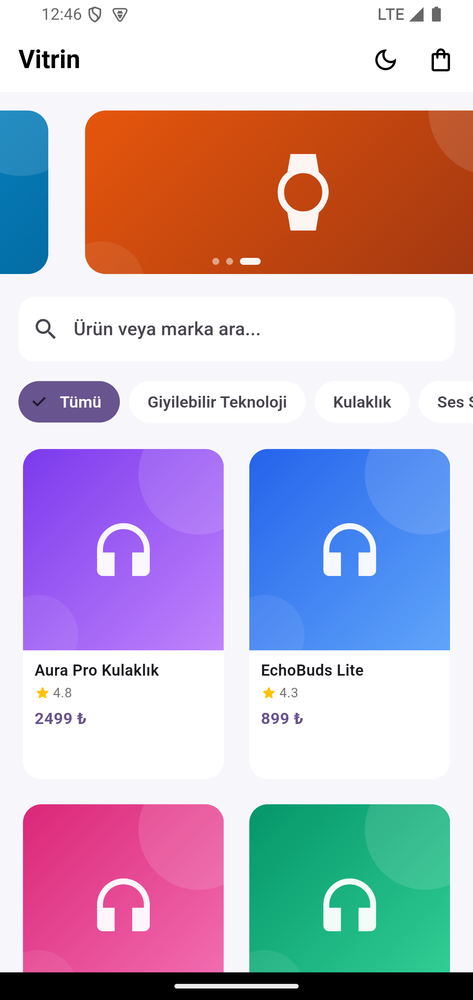
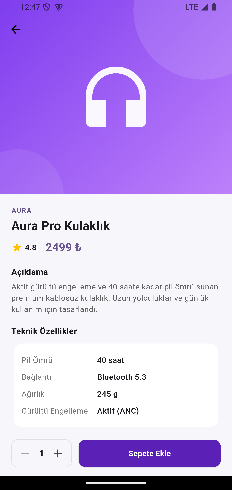
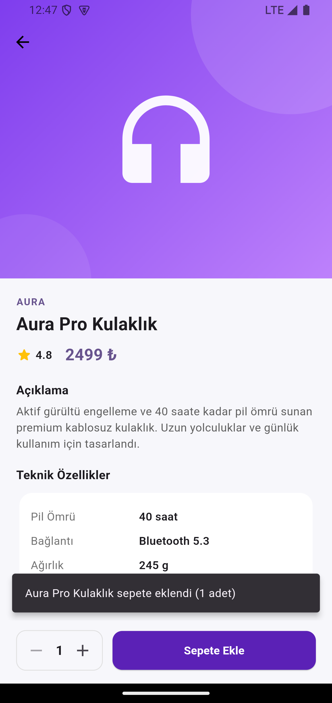
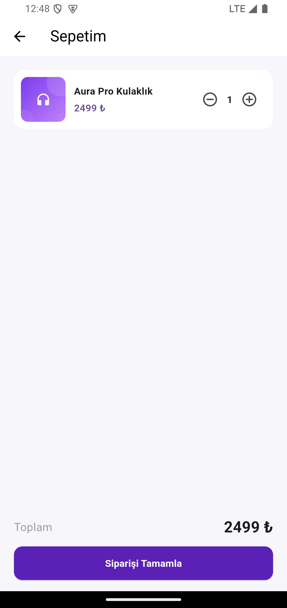
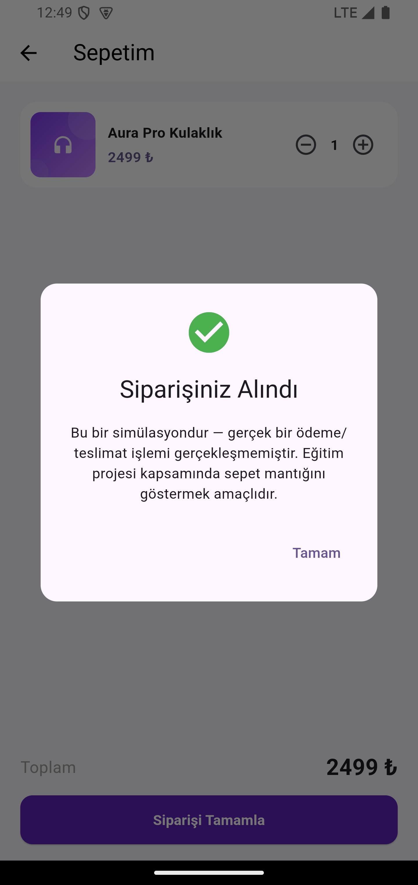
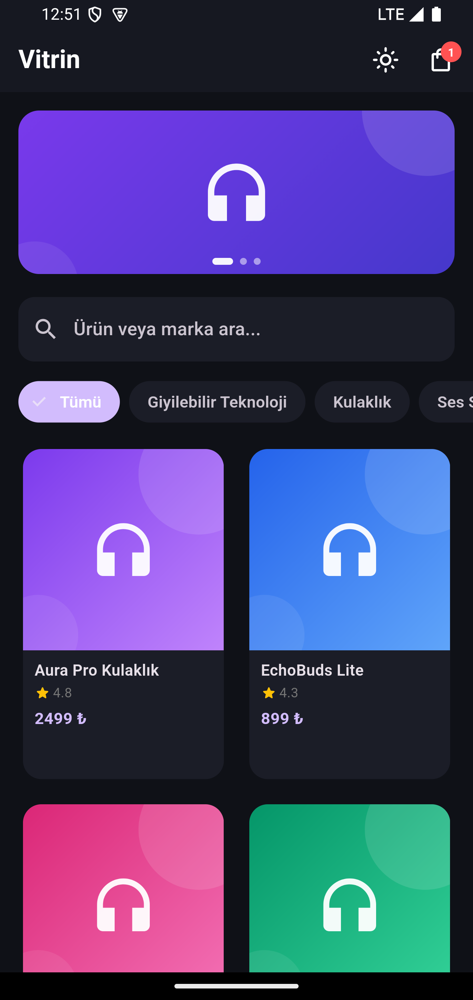

# 🛍️ Vitrin — Mini Katalog Uygulaması

SoftwarePersona Yazılım Stajı — **Mobil Uygulama Geliştirme (Flutter)** proje teslimi.

Flutter ile geliştirilmiş, teknoloji ürünleri (kulaklık, telefon, giyilebilir teknoloji, ses sistemleri)
satan bir mini katalog/e-ticaret vitrin uygulaması.

## Kısa Açıklama

Vitrin; ürünleri kategoriye göre filtreleyip arayabildiğiniz, bir ürünün detayına girip teknik
özelliklerini inceleyebildiğiniz, sepete ekleyip adetlerini güncelleyebildiğiniz ve "siparişi
tamamla" simülasyonuyla süreci tamamlayabildiğiniz bir mobil katalog uygulamasıdır.

**Önemli mimari karar:** Uygulama **hiçbir ek pub.dev paketi kullanmaz** — sadece Flutter/Dart SDK
çekirdeği (`material.dart`, `foundation.dart`, `dart:convert`). Bu, eğitim yönergesinin "ekstra paket
kullanımı yapılmayacaktır" şartına bilinçli bir uyumdur. Ürün verisi `assets/data/products.json`
içinden yerel olarak okunur (Gün 4: "Listeleme ve JSON Yapısı — Simülasyon" hedefiyle uyumlu),
gerçek bir backend'e bağlanmaz.

## Kullanılan Flutter Sürümü

- **Flutter 3.24.3** (stable channel)
- **Dart 3.5.3**

## Özellikler

- 🏠 **Ana Sayfa:** Otomatik kayan tanıtım banner'ı, arama, kategori filtreleme, ürün grid'i
- 🔍 **Arama & Filtre:** Ürün adı/markaya göre canlı arama + kategori çipleri
- 📦 **Ürün Detayı:** Hero geçiş animasyonu, açıklama, teknik özellik tablosu, adet seçici
- 🛒 **Sepet:** Adet güncelleme, ürün kaldırma, toplam tutar hesaplama
- ✅ **Sipariş Simülasyonu:** "Siparişi Tamamla" ile onay dialog'u (gerçek ödeme yapılmaz)
- 🌙 **Karanlık Mod:** AppBar'dan tek dokunuşla tema değişimi
- 🎨 **Splash Screen:** Animasyonlu açılış ekranı

## Proje Klasör Yapısı

```
lib/
├── main.dart                      # MaterialApp, named routes, ThemeMode yönetimi
├── models/
│   └── product.dart                # Product veri modeli (fromJson/toJson)
├── data/
│   └── product_repository.dart    # Yerel JSON'dan veri okuma (simülasyon)
├── state/
│   └── cart_model.dart             # ChangeNotifier tabanlı sepet state'i + CartScope
├── screens/
│   ├── splash_screen.dart
│   ├── home_screen.dart
│   ├── product_detail_screen.dart
│   └── cart_screen.dart
├── widgets/
│   ├── product_card.dart
│   ├── banner_carousel.dart
│   └── category_chip_bar.dart
└── theme/
    └── app_theme.dart              # Aydınlık/karanlık tema paleti
assets/
├── data/products.json              # 16 ürün, 4 kategori (simülasyon verisi)
└── images/                         # Özgün üretilmiş ürün/banner görselleri
```

## Çalıştırma Adımları

1. [Flutter SDK](https://docs.flutter.dev/get-started/install) kurulu olmalı (3.24.3 veya üzeri).
2. Bağımlılıkları indir:
   ```bash
   flutter pub get
   ```
3. Bir Android Emulator/iOS Simulator başlatın veya fiziksel cihaz bağlayın.
4. Uygulamayı çalıştırın:
   ```bash
   flutter run
   ```

Statik analiz için:
```bash
flutter analyze
```

## Ekran Görüntüleri

| Ana Sayfa | Ürün Detayı | Sepete Eklendi |
|---|---|---|
|  |  |  |

| Sepet | Sipariş Onayı | Karanlık Mod |
|---|---|---|
|  |  |  |

Tüm ekran görüntüleri gerçek bir Android Emulator'da (`Pixel 4 XL, Android 15 / API 35`)
çalıştırılarak alınmıştır.

## Proje Çıktıları

- [x] Çalışan bir "Mini Katalog Uygulaması"
- [x] Ana sayfa – ürün listesi – ürün detayı ekran yapısı
- [x] Sayfa geçişleri (Navigator, Named Routes)
- [x] Route Arguments kullanımı (ürün detayına geçişte)
- [x] GridView ile kart tabanlı tasarım
- [x] Basit state güncelleme örneği (sepet, `ChangeNotifier` ile)
- [x] Proje klasör yapısını doğru kullanma
- [x] Asset yönetimi (görseller, JSON)
